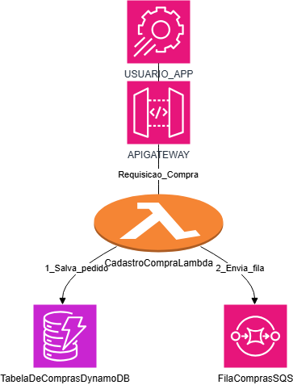

Tema do Projeto: Lance Relâmpago (Leilão de Centavos)
Este projeto simula o backend de um "Lance Relâmpago", um tipo de leilão online também conhecido como Leilão de Centavos (Penny Auction).

Este modelo de leilão é conhecido por ser extremamente dinâmico e gerar alta atividade de usuários, o que o torna um caso de uso perfeito para a arquitetura assíncrona com filas que foi implementada.

O Conceito (Leilão de Centavos)
O leilão funciona com regras específicas que incentivam lances rápidos e simultâneos:

Acréscimo Mínimo: Cada lance dado em um item aumenta seu preço final em um valor muito pequeno (ex: R$ 0,01).

Cronômetro Regressivo: Cada item tem um cronômetro (ex: 30 segundos).

Reinício do Cronômetro: Esta é a regra principal. Cada novo lance reinicia o cronômetro para 30 segundos.

Vencedor: O leilão só termina quando o cronômetro chega a zero. O último usuário a dar o lance vence e pode comprar o item pelo preço final (geralmente muito baixo).

Justificativa da Arquitetura
O nome "Lance Relâmpago" refere-se ao que acontece nos segundos finais do leilão: dezenas de usuários tentam dar um lance ao mesmo tempo para serem o "último" a clicar.

Isso cria uma "chuva de lances" (um pico extremo de tráfego) que um sistema simples não aguentaria.

A nossa arquitetura com uma fila (simulada pelo Lances PENDENTES) é a solução ideal:

A Lambda 1 (api_server.py) é rápida. Ela apenas recebe a "chuva" de lances e os joga na fila, respondendo ao usuário imediatamente.

A Lambda 2 (worker.py) pega os lances da fila, um de cada vez, e processa a lógica (if/else) para ver quem é o novo vencedor e reiniciar o cronômetro.

Essa arquitetura garante que o sistema seja escalável, não caia sob alta demanda e nenhum lance seja perdido.

# Projeto: Leilão Online (Simulação Local)

Este é um projeto simples em Python para simular uma arquitetura de leilão online desacoplada, similar ao que seria feito na AWS.

## Arquitetura (Simulada)

* **API Gateway (Simulado):** `api_server.py` (usando Flask). Recebe os lances.
* **Lambda 1 (Simulada):** A função `dar_lance()` no `api_server.py`. Ela é rápida e apenas "enfileira" o lance.
* **Fila SQS (Simulada):** Uma tabela `Lances` no banco `leilao.db`. O `api_server.py` insere lances com status `PENDENTE`.
* **Lambda 2 (Simulada):** O script `worker.py`. Ele roda separadamente, lendo a tabela `Lances` (a "fila") e processando os lances pendentes.
* **DynamoDB (Simulado):** A tabela `ItensLeilao` no banco `leilao.db`.

## Lógica Obrigatória

* **`for` loop:** Usado no `worker.py` para processar múltiplos lances da fila.
* **`if/else`:** Usado no `worker.py` para verificar se o `novo_lance` é maior que o `lance_atual`.

**Aqui está o fluxo:**

